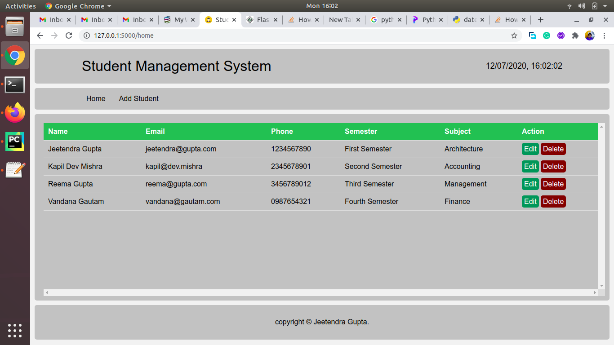
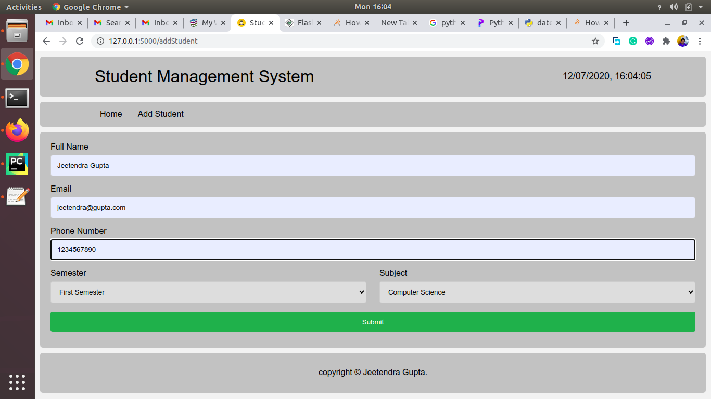
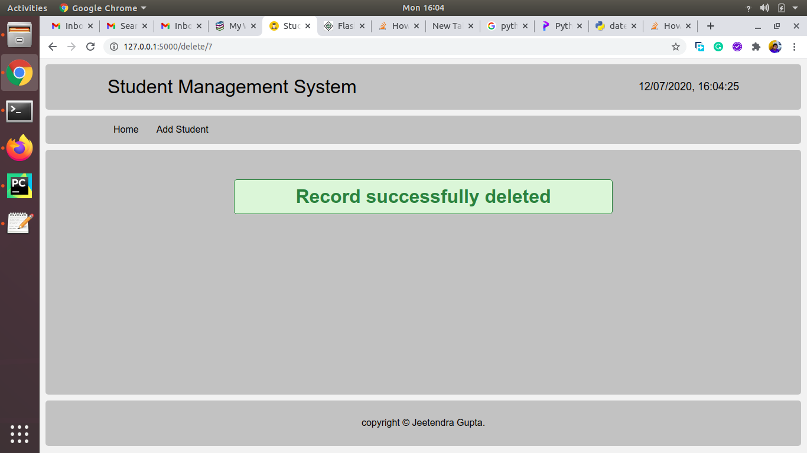

#  Python Flask Project ( Student Management System )

## What is Flask?
Flask is a web framework that provides libraries to build lightweight web applications in python. It is developed by Armin Ronacher who leads an international group of python enthusiasts (POCCO). It is based on WSGI toolkit and jinja2 template engine. Flask is considered as a micro framework.

## Flask Environment Setup
```
$ pip install virtualenv
$ mkdir new   
$ cd new   
$ virtualenv venv  
$ venv/bin/activate  
$ venv\scripts\activate  
$ pip install flask 
```

### First Flask application
```
from flask import Flask
#creating the Flask class object 
app = Flask(__name__)


@app.route('/')
def home():
    return "hello, this is our first flask website";


if __name__ =='__main__':
    app.run(debug = True)
```




